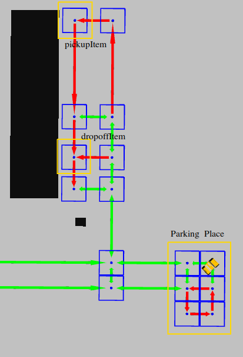
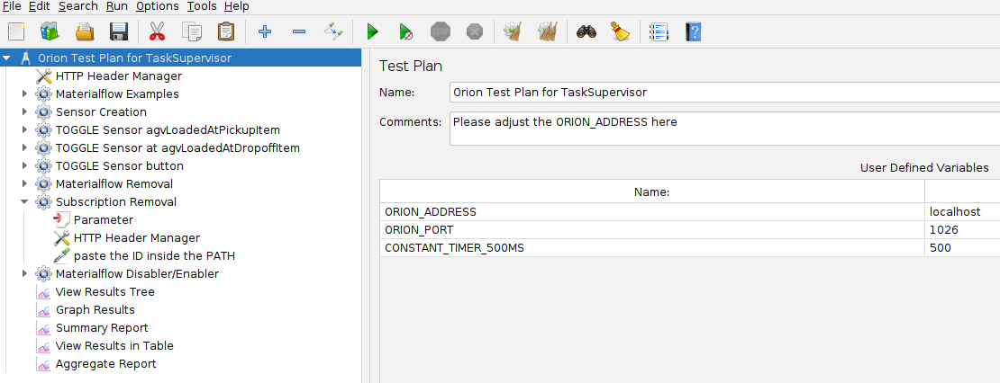
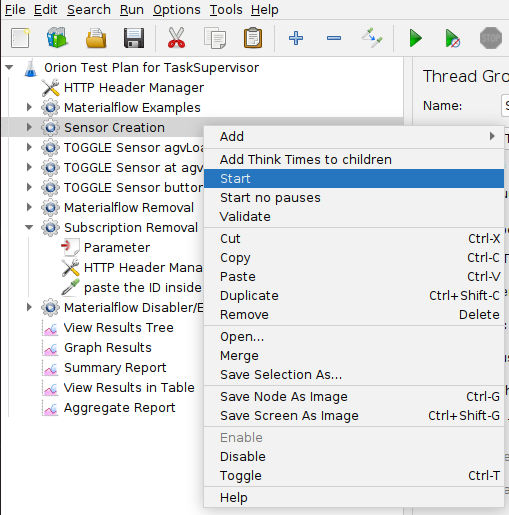
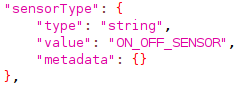
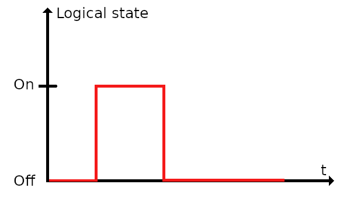
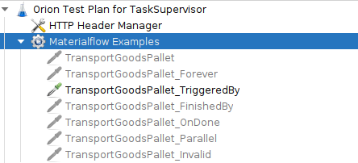
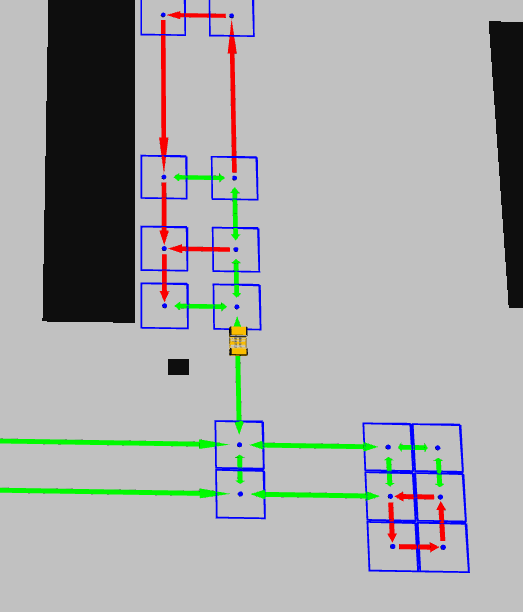
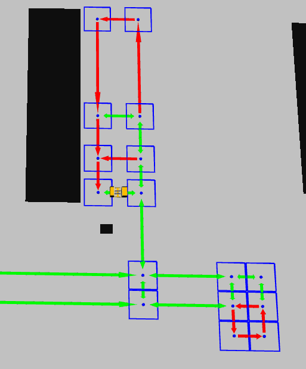
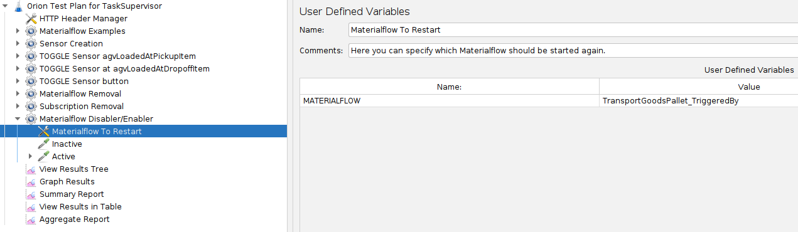

# Introduction

We provide a JMeter file for you containing a Test Plan to test the *TaskSupervisor*. There are a few Materialflow examples in the Test Plan which you can also find in the [Materialflows section](materialflows/transportorder-goodspallet.md). We will guide you through the first steps with our [TriggeredBy example](materialflows/transportorder-goodspallet-triggeredby.md)

We use RVIZ for visualization. To give you a better understanding here is an image of the simulated production hall:

Figure 1: The production hall contains many locations. Interesting for us is the Parking Place for the AGVs, the pickup location (pickupItem) and the dropoff location(dropoffItem).

## Working with JMeter

You can test the *TaskSupervisor* with JMeter. Open our Orion Test Plan file in JMeter.
If Orion and ROS are running you are ready to go. In the following there is a step-by-step instruction.

### Configure the Orion address
When you first start our Test Plan in JMeter make sure to configure the Orion address:

Figure 2: Adjust your Orion address.

### Why you want / need sensors
The next step will be to create the sensor entities which are used in the LoTLan file. In the file we defined 3 Events:

* *buttonPressed*
* *agvLoadedAtPickupItem*
* *agvLoadedAtDropoffItem*

*agvLoadedAtPickupItem* and *agvLoadedAtDropoffItem* are used to signalize that loading/unloading is done. Currently we dont have automatic loading and unloading avaiable so you need a way to signalize that it is done. Thats why in both TransportOrderStep we have a FinishedBy checking if the Events are True.

The *buttonPressed* Event is used to trigger the Task *transportGoodsPallet*. It could be a button next to the Parking Place which has to be pressed to start the Task.

### Create sensor entities
To create the sensor entites in Orion you have to start the *Sensor Creation* Thread Group in JMeter. This will create an entity for each of the sensors.

Figure 3: Right click on Sensor Creation and then click on Start.

Note that the current sensor are *On Off sensors*. If you use the *TOGGLE* Thread Group it wil set the value in Orion to True and immediately to False again.

|  |  |
:-------------------------:|:-------------------------:
|Figure 4: A Part of the sensor definition in *Sensor Creation*. | Figure 5: How does an ON_OFF Sensor work? Sensor is set to On for a short period of time and after that set back to Off again |

 

### Starting the Materialflow

Now we are ready to start the Materialflow. Open the *Materialflow Examples* section in JMeter and activate the TriggeredBy example. You can do that with the shortcut *CTRL + T* or by rightclicking on the example and pressing the toggle button. You can also activate more than one example resulting in parallel execution of the corresponding materialflows.

After you activated it start the *Materialflow Examples* Thread Group.

Figure 6: Expand Materialflow Examples and Activate TriggeredBy example with *CTRL + T*.

### Fire the buttonPressed event

The Task needs the button sensor to be toggled to start, so execute the *TOGGLE Sensor button* Thread Group.
An AGV should now start executing the Task:

Figure 7: The button sensor was toggled and the AGV starts with the TransportOrder.

### Fire *agvLoadedAtPickupItem* and *agvLoadedAtDropoffItem*
If the AGV arrives at the Pickup location you can start the *TOGGLE Sensor agvLoadedAtPickupItem* thread group.
The same goes for the Dropoff location with the *TOGGLE Sensor at agvLoadedAtDropoffItem* thread group.
After the AGV is done it will drive back to the Parking Place.

Figure 8: The AGV is done with the TransportOrder and drives back to the Parking Place.

### Restart a Materialflow
If you want to restart a Materialflow its entity has to be toggled in Orion. We created a Thread Group for that case named *Materialflow Disabler/Enabler*. If you open it you can edit the *MATERIALFLOW* user variable and type in the Materialflow example which you would like to restart. Afterwards start the Thread Group, the Materialflow should now start again.

Figure 9: Restart a Materialflow by starting the *Materialflow Disabler/Enabler* Thread Group.