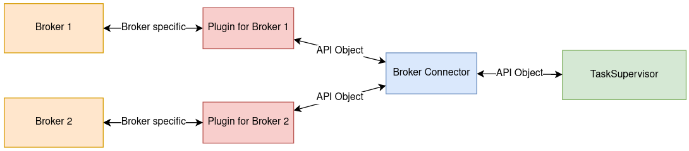

# Integrate your broker

We provide an abstract interface so you can integrate your Broker into the *TaskSupervisor*. You can get started by checking out an existing implementation of an interface or by following the documentation on this page. Before you start creating your own interface make sure to check if there is not already one provived by us.

Currently implementations for the following brokers are available:

* Orion Context Broker

There are entites/objects that the *TaskSupervisor* needs from outside and some which he creates. If your broker wants to send a specific entity to the *TaskSupervisor* or notifiy about a topic the interface have to convert it into a representation that the *TaskSupervisor* can use. The interface also needs to convert these objects back into a broker specific format. For more information about how the needed entities have to look, check out the [interfaces](interfaces.md) page. The functionality is illustrated in the following image:



Figure 1: Example with Two Brokers - Both have an own plugin.

You have to implement a set of methods in order for the *TaskSupervisor* to work properly. In the following we explain what each method should do.

**Note**: You have to take care of incoming messages yourself. For example if you use the Orion Context Broker you need to setup a webserver yourself and handle the incoming messages with an endpoint. To provide the *TaskSupervisor* with the objects you have to call the [retreive](#retreive) method of the *BrokerConnector* class.


## BrokerInterface

### Constructor

Every interface instance has a unique id and a name. Make sure to call the init method of the subclass when you implement your interface.

```python
def __init__(self, broker_connector, broker_name=""):
    self.broker_id = uuid.uuid4()
    self.broker_connector = broker_connector
    self.broker_name = broker_name
```

### start_interface
The interface will be started from here. You could use it for example to start Threads for a Webserver. Make sure that everything is working after this method is getting called.

```python
def start_interface(self):
```

### subscribe
Subscribes to the given topic. If your broker generates a subscription id return it after success otherwise generate one. The *TaskSupervisor* will use
this id at some point to delete subscriptions so make sure that the id is valid.

```python
def subscribe(self, topic, opt_data=None, generic=False):
```

**Parameters**:

* **topic**:    Will always be an api entity object. Could be converted into a broker specific format.
* **opt_data**: Optional data depending on the given topic. Check the documentation for more info.
* **generic**:  Boolean, True when subscription should be generic and False if not

**Return value**:

**subscription_id**: An id which is related to the subscription 

### create
Creates a new entry for the entity at the broker. Here you should convert the given entity in a specific format that your broker accepts.

```python
def create(self, entity):
```

**Parameters**:

* **entity**: An api entity object used in the TaskSupervisor.

### update
Updates the given entity at the broker. Here you should convert the given entity in a specific format that your broker accepts.

```python
def update(self, entity):
```

**Parameters**:

* **entity**: An api entity object used in the TaskSupervisor.

### delete

Handles deletion of entities and subscriptions. This method should be able to delete the entity or subscription the given id is refering to. In case of an subscription the id is the subscription id mentioned in [Subscribe](#subscribe). We distinguish entites from subscriptions so there is a boolean specifing if the id either refers to an entity or a subscription.

```python
def delete(self, id, delete_entity=True):
```

**Parameters**:

* **id**:             Either an entity id or an subscription id depending on delete_entity
* **delete_entity**:  Boolean, True if the id is from an entity and False if it is a subscription id


### shutdown

Gets called by the BrokerConnector when the TaskSupervisor is terminated. You can delete remaining entities and subscriptions here.

```python
def shutdown(self):
```

## BrokerConnector

### register_interface

Register the given interface in the *BrokerConnector*. It is important to register your Interface, otherwise the *TaskSupervisor* wont work.
```python
def register_interface(self,interface):
```

**Parameters**:

* **interface**: The interface which should be registered

### retreive

The given data will be passed in the *TaskSupersivor*. This method can be used inside an interface implementation when data from the Broker is received, therefore every Interface instance has a *BrokerConnector* object.

```python
def retreive(self, data, interface):
```

**Parameters**:

* **data**: Data the BrokerConnector should retreive, has to be an [API object](interfaces.md)
* **interface**: The interface which calls the retreive method


## Integrate your Interface implementation

If you are done implementing your Interface you can integrate it. We want the *TaskSupervisor* to be able to use multiple Brokers at once, so we provide a register_interface method by the *BrokerConnector* where you can register your interface. Currently you have to create and register your interface instance yourself in the main file.

Here is an excerpt of the main method as an example for the *OrionInterface* registration:

```python
.... 

# create and register interface instances here
orion_interface = OrionInterface(broker_connector, "Orion Context Broker Instance_1")
broker_connector.register_interface(orion_interface)

orion_interface.start_interface()

....
```